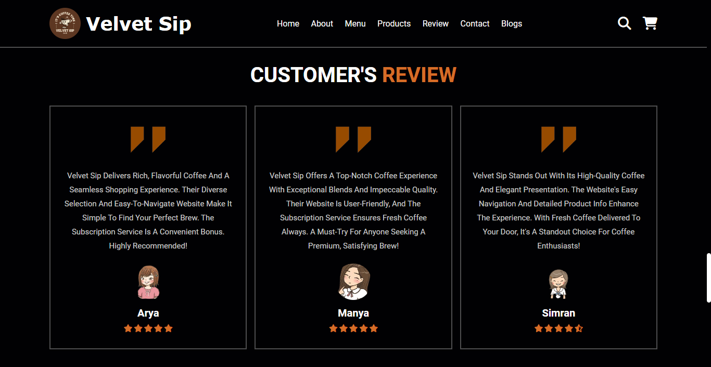

# Velvet Sip [](https://mohitaggarwal1.github.io/velvet-sip/)


## Live Demo

Check out the live website [here](https://mohitaggarwal1.github.io/velvet-sip/).

## Introduction

Welcome to Velvet Sip, Velvet Sip began with a simple idea: to transform the everyday coffee ritual into an extraordinary experience. Born out of a passion for quality and a love for rich, nuanced flavors, we set out on a journey to discover the finest coffee beans from around the world. Our founder Mr. Mohit Aggarwal, true coffee aficionados, were driven by a desire to create something special—something that goes beyond just a cup of coffee.

## Features

- **Browse Products:** Access a diverse range of best, unique and refreshing coffee products.
- **Responsive Design:** Optimized for different devices and screen sizes, enjoy a consistent and optimal viewing experience across all devices, including desktops, tablets, and mobile phones.
- **User-Friendly Interface:** Easy navigation and smooth user experience with an intuitive layout and design.

## Screenshots

### Menu Section


### Product Section


### Blogs Section


### Review Section



## Technologies Used

- **HTML**
- **CSS**
- **JavaScript**

## Getting Started

Follow these instructions to set up the project on your local machine.

### Prerequisites

- A modern web browser (e.g., Chrome, Firefox, Edge)

### Installation

1. Clone the repository:
    ```sh
    git clone https://github.com/MohitAggarwal1/velvet-sip.git
    ```

2. Navigate to the project directory:
    ```sh
    cd velvet-sip
    ```

3. Open `index.html` in your web browser to view the website.

## Usage

- Navigate through different categories of clothing.
- Add items to your cart and proceed to checkout.
- Use the search bar to quickly find specific products.

## Contact

- **GitHub:** [MohitAggarwal1](https://github.com/MohitAggarwal1)

## Acknowledgements

- Thanks to all contributors and users for their support.

